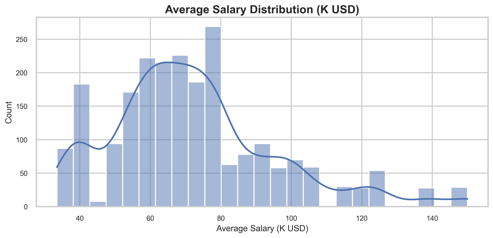
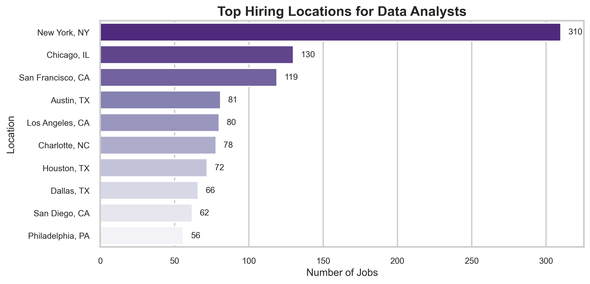
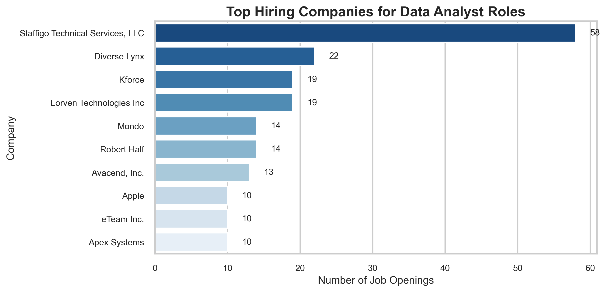
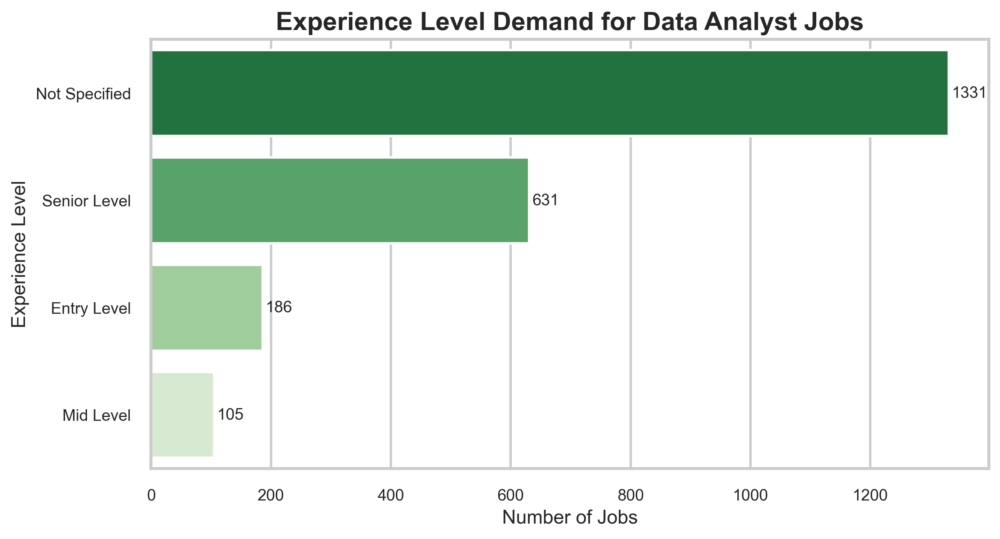
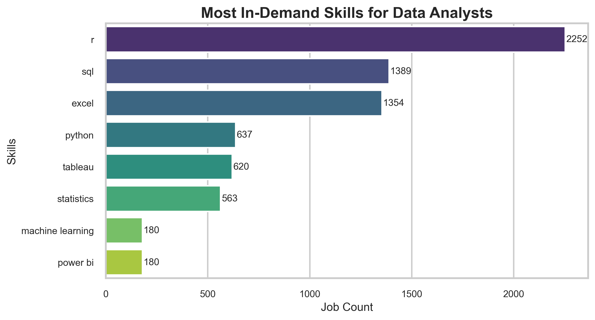

# Data Analyst Job Analysis 📊

This project explores a real Data Analyst job dataset to understand hiring trends, salary ranges, experience demand, and the most common skills mentioned in job descriptions.

The goal is to use Exploratory Data Analysis (EDA) and text analytics to answer practical questions like:
- Which locations have the most openings?
- Which companies are hiring the most?
- What experience level is commonly required?
- What skills are most frequently demanded?

---

## Key Highlights
- Cleaned and analyzed the dataset using Pandas
- Created multiple visualizations using Matplotlib & Seaborn
- Extracted experience levels from job descriptions
- Identified in-demand skills like Python, SQL, Excel, Power BI, Tableau, etc.
- Generated a WordCloud for the most common keywords in job postings
- Created an **industry-style Power BI Dashboard** 

---

## Tools & Libraries Used
- Python
- Pandas, NumPy
- Matplotlib, Seaborn
- WordCloud
- PowerBi

---

## Project Structure
Data-Analyst-Job-Analysis/
|__ PowerBi_Dashboard/
│── notebook/
│── data/
│── images/
│── README.md
│── requirements.txt
│── .gitignore

---

## Sample Visualizations

---

## Power BI Dashboard (Preview)
Interactive dashboard showing:
- Total Jobs, Avg Salary, Avg Rating, Easy Apply %
- Salary range by Industry
- Top Locations + Top Hiring Companies
- Skills/Industry demand
  

---

## Conclusion

This analysis gives a clear picture of what employers expect from Data Analyst candidates.
Most job roles strongly demand Python + SQL + Excel, along with visualization skills like Power BI.
The project can be extended further by adding salary prediction or building an interactive dashboard.

----

## Author
**Aparna Patel** 

